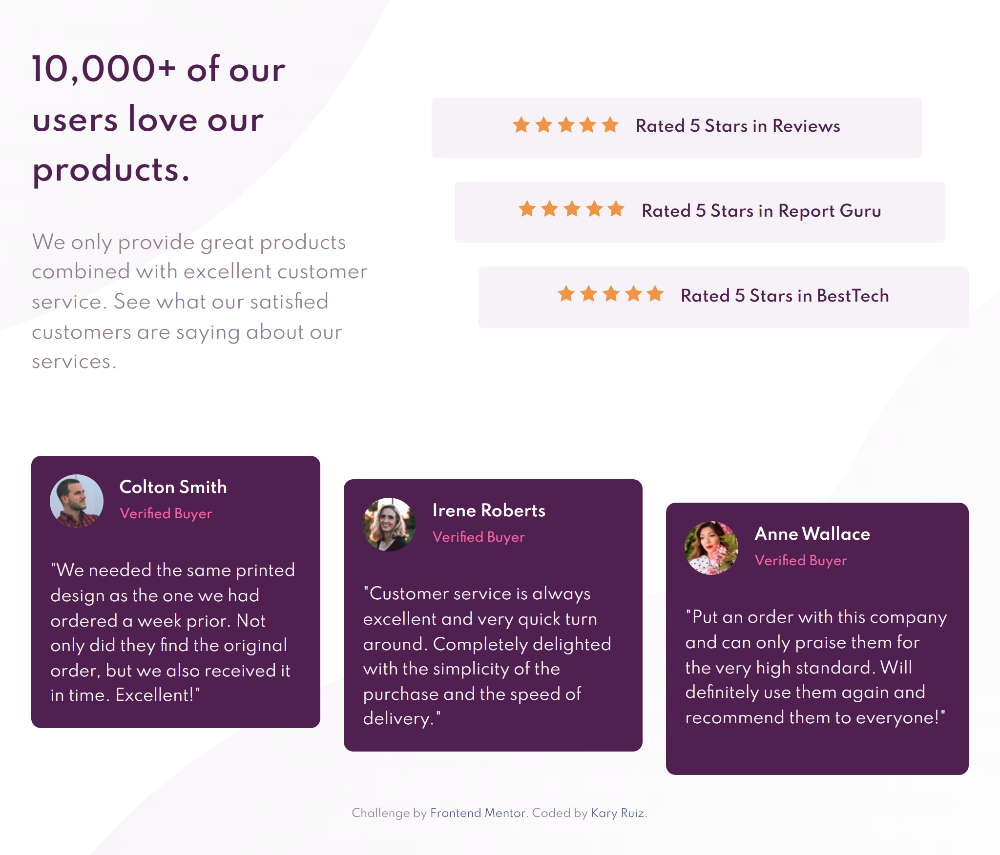

# Frontend Mentor - Social proof section solution

This is a solution to the [Social proof section challenge on Frontend Mentor](https://www.frontendmentor.io/challenges/social-proof-section-6e0qTv_bA). Frontend Mentor challenges help you improve your coding skills by building realistic projects. 

## Table of contents

- [Overview](#overview)
  - [The challenge](#the-challenge)
  - [Screenshot](#screenshot)
  - [Links](#links)
- [My process](#my-process)
  - [Built with](#built-with)
  - [What I learned](#what-i-learned)
  - [Continued development](#continued-development)
  - [Useful resources](#useful-resources)
- [Author](#author)

## Overview

### The challenge

Users should be able to:

- View the optimal layout for the section depending on their device's screen size

### Screenshot



### Links

- Solution URL: [Solution URL here](https://your-solution-url.com)
- Live Site URL: [Github Pages URL here](https://your-live-site-url.com)

## My process

### Built with

- Semantic HTML5 markup
- CSS custom properties
- Flexbox
- CSS Grid

### What I learned

In this project, I learned how to adjust rows and columns with the grid property.

>A `<grid>` is a set of intersecting horizontal and vertical lines defining columns and rows.

See below:

```css
.container {
  display: grid;
  grid-template-columns: repeat(3, auto);
  grid-template-rows: auto auto 1fr auto auto;
}
```

En el siguiente ejemplo, I used `<grid-area>`.
This property span one or more cells both by row or by column.

See below:

```css
.main {
  grid-template-areas:  "home ranking"
                        "comments comments";
}
.home {
  grid-area: home;
}
```

Too we can give it a track definition and it will become a grid.

See below:

```css
.sub-grid {
  grid-column-start: 1;
  grid-column-end: 4;
  grid-row-start: 1;
  grid-row-end: 2;
}
```

### Continued development

After this challenge, I think I have to practice with css grid.

### Useful resources

- [grid-area](https://css-tricks.com/snippets/css/complete-guide-grid/) - css-tricks.

## Author

- Frontend Mentor - [@Kary01](https://www.frontendmentor.io/profile/Kary01)
